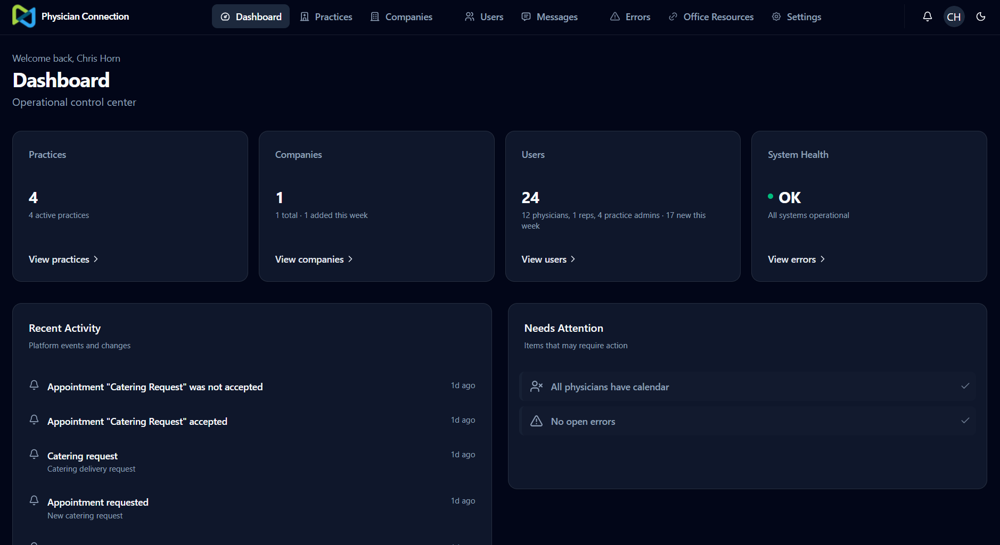
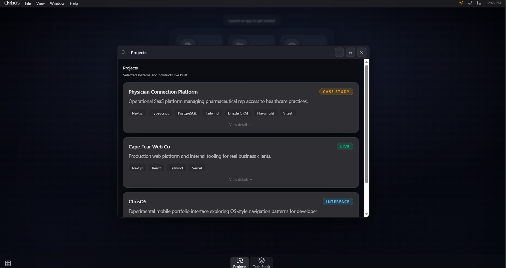

<h1 align="center">Chris Horn</h1>

Full-stack developer building production SaaS platforms, operational tools, and modern web applications.

I enjoy building software that supports real business workflows and helping teams move products toward stable, production-ready systems.

<a href="https://chrisos.dev">Portfolio</a> •
<a href="https://github.com/ChrisHorn-Dev/case-studies">Case Studies</a> •
<a href="https://linkedin.com/in/chris-horn-5b70ab369">LinkedIn</a>

━━━━━━━━━━━━━━━━━━━━━━━━━━━━━━━━━━━━━━━━━━━━━━━━━━━━━━━━━━━━

 

# Physician Connection Platform

Production SaaS platform connecting pharmaceutical representatives with physician practices to coordinate scheduling, hosted meetings, and approval workflows.

  

### Key Contributions

- Representative appointment request workflows
- Role-based dashboards for physicians, representatives, and practice administrators
- Authentication architecture and protected route system
- Calendar scheduling and visit management
- Refining core product workflows as the platform progressed toward MVP readiness

 

<table>
<tr>
<td width="55%">

## About

I focus on building practical software that supports real operational workflows. Much of my work centers around SaaS platforms, scheduling systems, and internal tools built with React and Next.js.

I enjoy contributing to products as they evolve — improving architecture, refining workflows, and strengthening the user experience as systems move toward reliable production use.

Outside of development, I enjoy playing guitar and singing for people, traveling whenever I get the chance, and unwinding with video games.

</td>

<td width="45%">

## Tech Stack

</td>
</tr>
</table>

 

# GitHub Overview

 

# Additional Work

Some systems I contribute to are private or employer-owned, so source code cannot always be shared publicly.

Selected case studies describing my work and technical contributions can be found here:

→ **[Case Studies](https://github.com/ChrisHorn-Dev/case-studies)**

 

# ChrisOS

Experimental developer portfolio exploring OS-style navigation patterns and interactive UI design.

  

 

# Connect

Always happy to talk about SaaS products, software architecture, and interesting technical challenges.
